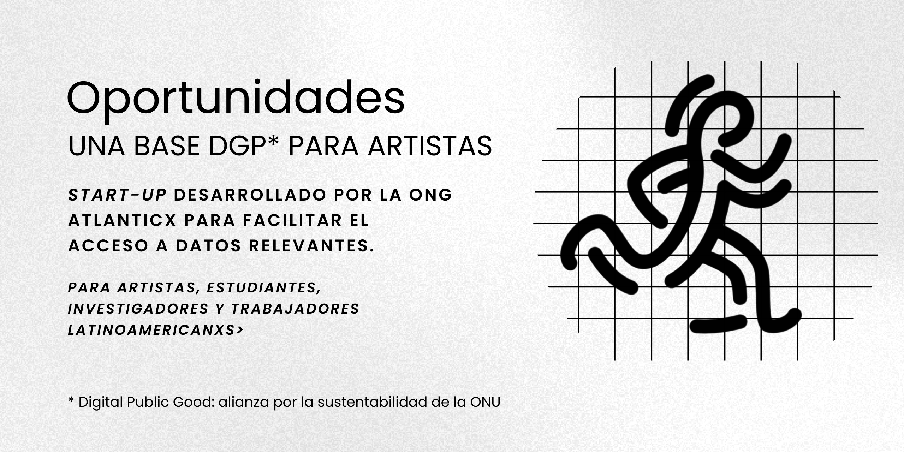

# Oportunidades (una base de datos para artistas).

## [English version below](#description)

### Descripción

Oportunidades DGP es una start-up con fines culturales. Impulsados por la ONG Atlanticx nos dedicamos a conectar a los **artistas, estudiantes, investigadores y trabajadores culturales** del continente con **convocatorias globales** de desarrollo profesional y formación. El proyecto utiliza los criterios de sostenibilidad e impacto social de la alianza ["Digital Public Goods"](https://www.un.org/techenvoy/content/digital-public-goods).

### Un modelo "anti-negocio"

Los datos que proveemos tienen origen en un proceso de "scrapping" que extrae información monetizada. Nuestro modelo es el del impulso cultural: en lugar de cobrar la información la brindamos sin publicidad, sin vender los datos y sin ninguna condición o lucro. Se trata de un proyecto de mecenazgo en el ámbito digital. 

### Para Artistas, Estudiantes, Investigadores y Agentes de la Cultura

  
**¿Cómo acceder?:**

Existen dos métodos. Podés utilizar nuestra serivico web gratuito que incluye actualizaciones automáticas, filtros y un potente motor de búsqueda en la siguiente dirección: [servicio web](https://oportunidades.lat). También [podés descargar el archivo CSV](Oportunidades_Dic_2024.csv) que contiene todos los datos que utilizamos. 

  
**¿Qué permite el servicio web?:**

La web app de [oportunidades](https://oportunidades.lat) filtra automáticamente las oportunidades **actualmente abiertas** y permite, además, **búsquedas avanzadas y guardar oportunidades** (para su posterior recuperación --r equiere login). También podés utilizar la web app para compartir los datos en redes sociales. 

### Para Desarrolladores

  
**Iniciativa de Código Abierto:**

Estamos en el proceso de pulir y documentar el código que sostiene el servicio. Buscamos hacerlo disponible como una base open source de calidad. Actualmente, el código se aloja en el repositorio personal de Miguel Galperin (desarrollador y fundador de Atlanticx) mientras trabajamos en su mejora. Puedes encontrarlo en [Oportunidades en GitHub](https://github.com/MiguelGalp/Oportunidades). Pronto será trasladado al repositorio institucional [Atlanticx-Datos/100_Oportunidades](https://github.com/Atlanticx-Datos/100_Oportunidades).
- **Desarrollo Colaborativo:** Nos interesa que te sumes a nuestra comunidad de desarrolladores para mejorar la plataforma, corregir imperfecciones e implementar nuevas características.
- **Tecnología Utilizada:** Construido con Flask, integrado con Notion (DB + IA) y Auth0, y optimizado con caché de Redis.

Damos la bienvenida a contribuciones de desarrolladores de todos los niveles. Ya sea que estés interesado en corregir errores, agregar nuevas características o mejorar la documentación, tu aporte es valioso. 

---

## Description

+ Oportunidades is a platform dedicated to connecting **artists, students, researchers and cultural workers** from the continent with **global calls** for professional development and training. The project builds public data regarding grants, residencies, production and/or mobility funds, awards and competitions. Our mission is to ensure that these opportunities are treated from the perspective of the ["Digital Public Goods"](https://www.un.org/techenvoy/content/digital-public-goods) alliance, **a UN project to promote open source for social impact**. At the same time, we invite developers to join us in refining and expanding this project by gradually making it open source.

### Origin of Opportunities

As part of its mission regarding the pre-development of artists and researchers, the [NGO Atlanticx](https://atlanticx.org) developed an automated scraping process. It is a script that uses the javascript library called "Playright" to collect information. This method allows us to overcome some subscription walls within projects that monetize the distribution of information and, above all, to update the data in a sustainable way and do so within the framework of the accessibility and impact guidelines of the DPG alliance.

### For Artists, Students, Researchers and Cultural Workers

- **Access Opportunities:** Download our database in CSV format. The file contains the opportunities that feed [the web service](https://oportunidades.lat)
- **Search by closing month or category:** The web service filters only those opportunities that are currently open. The service also allows you to search by month and category as well as save and share opportunities individually.
- **Save and share opportunities:** 100+ Opportunities allows you to save and share links to opportunities through social networks (WhatsApp, LinkeIn) and email.

### For Developers

- **Open Source Initiative:** We are in the process of polishing and documenting our codebase to make it truly open-source. Currently, the code It is hosted in the personal repository of Miguel Galperin (developer and founder of Atlanticx) while we work on improvements. You can find it at [Oportunidades on GitHub](https://github.com/MiguelGalp/Oportunidades). It will soon be moved to the institutional repository [Atlanticx-Datos/100_Oportunidades](https://github.com/Atlanticx-Datos/100_Oportunidades).
- **Collaborative Development:** Join our community of developers to improve the platform, fix rough edges, and implement new features.
- **Tech Stack:** Built with Flask, integrated with Notion and Auth0, and optimized with Redis caching.

### Getting Started

1. **For Users:** Visit our [website](http://oportunidades-vercel.vercel.app) to explore opportunities and our tools (sharing and saving).
2. **For Developers:** Clone the personal repository and follow the setup instructions in the README to start contributing.

### Contributing

We welcome contributions from developers of all levels. Whether you're interested in fixing bugs, adding new features, or improving documentation, your input is valuable. Please check our [contributing guidelines](CONTRIBUTING.md) for more information.

### Join Us

Be part of a project that not only connects artists with opportunities but also fosters a collaborative open-source community. Together, we can make 100 ︱ Oportunidades a comprehensive and accessible resource for artists worldwide.
