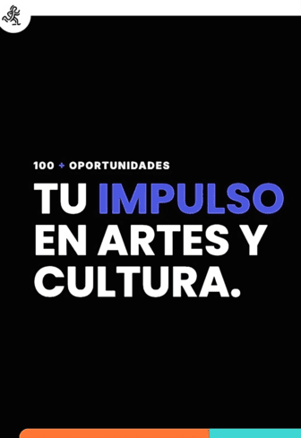

# 100 + Oportunidades (convocatorias para arte y cultura).

## [English version below](#description)

### Descripción

100 + Oportunidades es una plataforma dedicada a conectar a los **artistas, estudiantes, investigadores y trabajadores culturales** del continente con **convocatorias globales** de desarrollo profesional y formación. El proyecto construye datos abiertos en relación a becas, residencias, fondos de producción y/o movilidad, premios y concursos. Utilizamos la perspectiva que plantea la alianza "Digital Public Goods", **un proyecto de fomento al código abierto de impacto social de la ONU**. Al mismo tiempo, invitamos a desarrolladores a unirse a nosotros para refinar y expandir este proyecto.

### Origen de las Oportunidades

Las oportunidades presentadas en nuestra plataforma se obtienen a través de un proceso automatizado. Se trata de un script que utiliza la librería de javascript llamada "Playright" para recopilar información de varios sitios web. Este método nos permite superar algunos muros de subscripción dentro de proyectos monetizados y, sobretodo, hacer accesible la información en el marco de los lineamientos de accesibilidad de la alianza DPG.

### Para Artistas, Estudiantes, Investigadores y Agentes de la Cultura

- **Accede a Oportunidades:** Descargá nuestra base de datos [en formato CSV](https://github.com/Atlanticx-Datos/100_Oportunidades/Oportunidades_Dic_2024.csv). El archivo contiene las oportunidades que alimentan el [servicio web](https://github.com/Atlanticx-Datos/100_Oportunidades), donde las oportunidades son filtradas solo por aquellas actualmente abiertas. El servicio permite además guardar y compartir oportunidades individualmente. 
- **Mantente Actualizado:** Las actualizaciones regulares aseguran que tengas acceso a las oportunidades más actuales disponibles en todo el mundo.

### Para Desarrolladores

- **Iniciativa de Código Abierto:** Estamos en el proceso de pulir y documentar el código que sostiene el servicio. Buscamos hacerlo disponible como una base open source de calidad. Actualmente, el código se aloja en un repositorio personal mientras trabajamos en su mejora. Puedes encontrarlo en [Oportunidades en GitHub](https://github.com/MiguelGalp/Oportunidades). Pronto será trasladado al repositorio institucional [Atlanticx-Datos/100_Oportunidades](https://github.com/Atlanticx-Datos/100_Oportunidades).
- **Desarrollo Colaborativo:** Nos interesa que te sumes a nuestra comunidad de desarrolladores para mejorar la plataforma, corregir imperfecciones e implementar nuevas características.
- **Tecnología Utilizada:** Construido con Flask, integrado con Notion y Auth0, y optimizado con caché de Redis.

### Para empezar

1. **Para Usuarios:** Visita nuestro [sitio web](http://oportunidades.lat) para explorar oportunidades y nuestras herramientas (compartir y guardar).
2. **Para Desarrolladores:** Clona el repositorio personal y sigue las instrucciones de configuración en el README para comenzar a contribuir.

### Contribuciones

Damos la bienvenida a contribuciones de desarrolladores de todos los niveles. Ya sea que estés interesado en corregir errores, agregar nuevas características o mejorar la documentación, tu aporte es valioso. Por favor, consulta nuestras [directrices de contribución](CONTRIBUTING.md) para más información.

### Únete a Nosotros

Sé parte de un proyecto que no solo conecta a artistas con oportunidades, sino que también fomenta una comunidad colaborativa de código abierto. Juntos, podemos hacer de 100 ︱ Oportunidades un recurso completo y accesible para artistas, estudiantes, investigadores y trabajadores culturales en todo el mundo.

---

## Description

100 + Opportunities is a platform dedicated to connecting **artists, students, researchers and cultural workers** from the continent with **global calls** for professional development and training. The project builds public data regarding grants, residencies, production and/or mobility funds, awards and competitions. Our mission is to ensure that these opportunities are treated from the perspective of the "Digital Public Goods" alliance, **a UN project to promote open source for social impact**. At the same time, we invite developers to join us in refining and expanding this project by gradually making it open source.

### Origin of Opportunities

The opportunities presented on our platform are obtained through an automated process. It is a script that uses the javascript library called "Playright" to collect information from various websites. This method allows us to overcome some subscription walls within monetized projects and, above all, to make the information accessible within the framework of the accessibility guidelines of the DPG alliance.

### For Artists, Students, Researchers and Cultural Workers

- **Access Opportunities:** Download periodic CSV files containing the latest opportunities directly from our Notion database.
- **Stay Updated:** Regular updates ensure you have access to the most current opportunities available worldwide.

### For Developers

- **Open Source Initiative:** We are in the process of polishing and documenting our codebase to make it truly open-source. Currently, the code is hosted in a personal repository while we work on improvements. You can find it at [Oportunidades on GitHub](https://github.com/MiguelGalp/Oportunidades). It will soon be moved to the institutional repository [Atlanticx-Datos/100_Oportunidades](https://github.com/Atlanticx-Datos/100_Oportunidades).
- **Collaborative Development:** Join our community of developers to improve the platform, fix rough edges, and implement new features.
- **Tech Stack:** Built with Flask, integrated with Notion and Auth0, and optimized with Redis caching.

### Getting Started

1. **For Users:** Visit our [website](http://oportunidades-vercel.vercel.app) to explore opportunities and our tools (sharing and saving).
2. **For Developers:** Clone the personal repository and follow the setup instructions in the README to start contributing.

### Contributing

We welcome contributions from developers of all levels. Whether you're interested in fixing bugs, adding new features, or improving documentation, your input is valuable. Please check our [contributing guidelines](CONTRIBUTING.md) for more information.

### Join Us

Be part of a project that not only connects artists with opportunities but also fosters a collaborative open-source community. Together, we can make 100 ︱ Oportunidades a comprehensive and accessible resource for artists worldwide.
